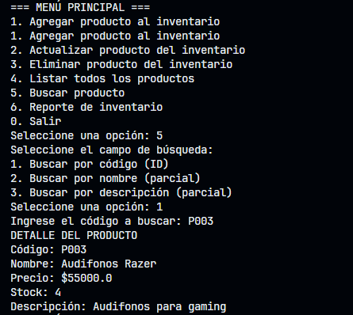
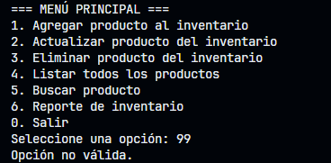

# Evidencia

## Tabla de pruebas

| ID  | Caso de prueba                                              | Secuencia de entrada (consola)                                                                                                                                                      | Estado inicial                                                                                                               | Resultado esperado                                                                                                               | Resultado observado | Notas / cómo forzar fallo                                                                                 |
|-----|-------------------------------------------------------------|-------------------------------------------------------------------------------------------------------------------------------------------------------------------------------------|------------------------------------------------------------------------------------------------------------------------------|----------------------------------------------------------------------------------------------------------------------------------|---------------------|------------------------------------------------------------------------------------------------------------|
| T01 | Agregar producto — caso válido                              | Menú -> 1 -> Código: P007 -> Nombre: Mouse Logitech -> Descripción: Mouse óptico -> Precio: 15000 -> Stock: 12                                                                        | Productos P001..P006 presentes                                                                                               | Mensaje "Producto agregado correctamente." y P007 presente en inventario                                                         | Mensaje "Producto agregado correctamente."                    | Añadir producto con código nuevo                                                                           |
| T02 | Agregar producto — código duplicado                         | Menú -> 1 -> Código: P001 -> ... resto campos válidos                                                                                                                               | P001 existe                                                                                                                  | Mensaje "Ya existe un producto con ese código." y no duplicar                                                                    | Mensaje "Ya existe un producto con ese código."                    | Forzar usando código existente P001                                                                        |
| T03 | Agregar producto — input no numérico para precio            | Menú -> 1 -> Código: P008 -> Nombre: X -> Precio: "abc" -> re-introducir inválido                                                                                                   | Estado inicial                                                                                                               | Mensaje de validación (reintentar) o rechazo sin agregar                                                                        | Se solicita al usuario reintentar                     | Ingresar texto en campo numérico; verificar manejo de NumberFormatException                               |
| T04 | Agregar producto — campo obligatorio vacío                  | Menú -> 1 -> Código: (ENTER) -> Nombre: ...                                                                                                                                         | Estado inicial                                                                                                               | Vista solicita nuevamente el campo obligatorio o muestra error; no se agrega                                                     | Vista solicita nuevamente el campo obligatorio                    | Dejar código vacío para verificar validación en ProductoView                                                |
| T05 | Actualizar producto — caso válido                           | Menú -> 2 -> Código: P002 -> Cambiar precio a 1150000 -> Mantener otros campos (ENTER)                                                                                              | P002 presente                                                                                                                | Mensaje "Producto actualizado correctamente." y P002 con nuevo precio                                                           | Mensaje "Producto actualizado correctamente."                    | Verificar que campo vacío mantiene valor previo                                                             |
| T06 | Actualizar producto — producto inexistente                  | Menú -> 2 -> Código: P999                                                                                                                                                           | P999 no existe                                                                                                               | Mensaje "No existe un producto con ese código."                                                                                 | Mensaje "No existe un producto con ese código.                    | Intentar actualizar código que no existe                                                                    |
| T07 | Eliminar producto — caso válido                             | Menú -> 3 -> Código: P005                                                                                                                                                            | P005 presente                                                                                                                | Mensaje "Producto eliminado correctamente." y P005 no aparece en listado                                                         |     Mensaje "Producto eliminado correctamente." y P005 no aparece en listado                 | Verificar eliminación real en listar                                                                         |
| T08 | Eliminar producto — inexistente                             | Menú -> 3 -> Código: P999                                                                                                                                                            | P999 no existe                                                                                                               | Mensaje "No existe un producto con ese código."                                                                                 |  Mensaje "No existe un producto con ese código.                   | Intentar eliminar código incorrecto                                                                         |
| T09 | Listar productos — caso general                             | Menú -> 4                                                                                                                                                                           | P001..P006 presentes (o tras T07 sin P005)                                                                                   | Lista con todos los productos actuales (cada producto mostrando descripción completa)                                           |   Lista con todos los productos actuales                  | Verificar formato legible y que coincida con inventario                                                     |
| T10 | Buscar producto por ID — encontrado                         | Menú -> 5 -> Opción 1 -> Código: P003                                                                                                                                               | P003 presente                                                                                                                | Se muestra descripción completa de P003                                                                                         |   Se muestra descripción completa de P003                  | Verificar búsqueda exacta por ID                                                                             |
| T11 | Buscar producto por ID — no encontrado                      | Menú -> 5 -> Opción 1 -> Código: P999                                                                                                                                               | P999 no existe                                                                                                               | Mensaje "No se encontró el producto con ese código."                                                                            |    Mensaje "No se encontró el producto con ese código.                 |                                                                                                            |
| T12 | Buscar por nombre (parcial) — múltiples resultados          | Menú -> 5 -> Opción 2 -> Nombre: "Laptop"                                                                                                                                            | P001, P002 presentes                                                                                                         | Se listan P001 y P002                                                                                                            |    Se listan P001 y P002                  | Probar con subcadena parcial "top" o distinto case para validar case-insensitive                            |
| T13 | Buscar por nombre (parcial) — sin resultados                | Menú -> 5 -> Opción 2 -> Nombre: "Tablet"                                                                                                                                            | ninguno con "Tablet"                                                                                                         | Mensaje "No se encontraron productos con ese nombre."                                                                            |   Mensaje "No se encontraron productos con ese nombre.                   |                                                                                                            |
| T14 | Buscar por descripción (parcial) — resultado                | Menú -> 5 -> Opción 3 -> Descripción: "gaming"                                                                                                                                        | P002 y P003 tienen "gaming"                                                                                                  | Se listan P002 y P003                                                                                                            |  Se listan P002 y P003                   | Case-insensitive parcial                                                                                     |
| T15 | Buscar — input vacío en búsqueda parcial                    | Menú -> 5 -> Opción 2 -> Nombre: (ENTER)                                                                                                                                             | Estado inicial                                                                                                               | Debe manejarse: mostrar todos o pedir reentrada; preferible solicitar entrada válida                                              | Agora se indica que el input no debe ir vacio -> Anteriormente mostraba todos los registros                    | Forzar ENTER vacío para validar manejo                                                                        |
| T16 | Menú — opción inválida (alfanumérica)                       | Menú -> "x"                                                                                                                                                                         | Estado inicial                                                                                                               | Vista muestra mensaje "Opción no válida." o solicita reintento sin crashear                                                      |    Vista muestra mensaje "Opción no válida."                 | Ingresar letra en elección de menú                                                                            |
| T17 | Menú — opción fuera de rango                                 | Menú -> 99                                                                                                                                                                          | Estado inicial                                                                                                               | Mensaje "Opción no válida." y volver a mostrar menú                                                                             | Vista muestra mensaje "Opción no válida."                    |                                                                                                            |
| T18 | Reporte inventario — caso general                           | Menú -> 6                                                                                                                                                                           | Productos presentes                                                                                                          | Mostrar resumen: total productos, total unidades, valor total (suma precio*stock). No pide umbral.                               |  total productos, total unidades, valor total (suma precio*stock) correctos en base a las modificaciones realizadas durante las pruebas                   | Validar cálculo: para el stack dado, calcular totales y comparar                                             |
| T19 | Reporte inventario — precisión numérica                     | Menú -> 6                                                                                                                                                                           | Estado inicial                                                                                                               | Valor total calculado correctamente y sin overflow                                                                 |  Los valores de suma = Σ(precio*stock) son correctos dado que se calculan directamente desde la lógica del modelo            | Verificar suma = Σ(precio*stock)                                                                              |
| T20 | Flujo completo — secuencia de operaciones                   | 4 (listar) -> 5 buscar nombre "Teclado" -> 1 agregar P007 -> 4 listar -> 3 eliminar P007 -> 4 listar                                                                               | Estado inicial                                                                                                               | Comportamiento consistente en todas las operaciones, inventario actualizado en cada paso                                         |  Se observa un comportamiento consistente al seguir el flujo normal que llevaría un usuario en consola                   | Validar consistencia de estado entre operaciones                                                              |

## Pruebas Unitarias

### Producto

- T01 Agregar válido:
  - Prueba:
    - Teclear en menú: 1
      - Código: P007
      - Nombre: Mouse Logitech
      - Descripción: Mouse óptico
      - Precio: 15000
      - Stock: 12
  - Evidencia:

- T02 Agregar duplicado:
  - Prueba:
    - Menú: 1
      - Código: P001
      - Resto datos (cualquiera) -> Esperar mensaje de código duplicado
  - Evidencia:

- T03 Precio no numérico:
  - Prueba:
    - Menú: 1
      - Código: P008
      - Nombre: X
      - Precio: abc (ver si la vista pide reingresar o muestra error)
      - Si pide reintentar, ingresar 1000 y continuar.
  - Evidencia:  

- T04 Campo obligatorio vacío (código):
  - Prueba:
    - Menú: 1
      - Código: (ENTER) -> verificar que la vista pida reingresar o muestre error
  - Evidencia:

- T05 Actualizar válido:
  - Prueba:
    - Menú: 2
      - Código: P002
      - Nuevo nombre: (ENTER) — mantener
      - Nuevo precio: 1150000
      - Nuevo stock: (ENTER) — mantener
      - Nueva descripción: (ENTER) — mantener
  - Evidencia:

- T06 Actualizar inexistente:
  - Prueba:
    - Menú: 2
      - Código: P999 -> esperar mensaje "No existe..."
  - Evidencia:

- T07 Eliminar válido:
  - Prueba:
    - Menú: 3
      - Código: P005 -> esperar "Producto eliminado correctamente."
  - Evidencia:

Lista previo a eliminación:

Eliminación P005:

Lista posterior a eliminación:

- T08 Eliminar inexistente:
  - Prueba:
    - Menú: 3
      - Código: P999 -> esperar mensaje de no existencia
  - Evidencia:

### Inventario

- T09 Listar productos:
  - Prueba:
    - Menú: 4 -> revisar listado mostrado
  - Evidencia:

- T10 Buscar por ID encontrado:
  - Prueba:
    - Menú: 5
    - Elegir opción de búsqueda: 1
    - Código: P003
  - Evidencia:

- T11 Buscar por ID no encontrado:
  - Prueba:
    - Menú: 5 -> opción 1 -> P999
  - Evidencia:

- T12 Buscar por nombre parcial:
  - Prueba:
    - Menú: 5 -> opción 2 -> escribir: Laptop
  - Evidencia:

- T13 Buscar por nombre sin resultados:
  - Prueba:
    - Menú: 5 -> opción 2 -> Tablet
  - Evidencia:

- T14 Buscar por descripción parcial:
  - Prueba:
    - Menú: 5 -> opción 3 -> gaming
  - Evidencia:

- T15 Búsqueda con input vacío:
  - Prueba:
    - Menú: 5 -> opción 2 -> (ENTER) -> observar comportamiento
  - Evidencia:

**Anomalía:**

- Retornaba todos los productos de la colección:
(img/Anomalía_T14.png)

- **Corrección:**
- Se agrega una validación adicional en el método para evitar retornar la lista si el input está vacío

## Pruebas de integración

### Menu Principal

- T16 Opción inválida (alfanumérica)
  - Prueba:
    - Menú -> "x"
  - Evidencia:

- T17 Opción fuera de rango:
  - Prueba:
    - Menú: 99 -> observar mensaje "Opción no válida."
  - Evidencia:

- T18 / T19 Reporte inventario:
  - Prueba:
    - Menú: 6 -> revisar resumen mostrado; validar totales (ver nota de cálculo en la tabla)
  - Evidencia:

- T20 Flujo completo:
  - Prueba:
    - Menú:4 -> Menú: 5(op2) -> Teclado -> 1 (agregar P007) -> 4 listar -> 3 eliminar P007 -> 4 listar
  - Evidencia:

Listado inicial:

Buscar por nombre:

Agregar P007:

Listado luego de añadir registro:

Eliminar P007:

Listado final:

